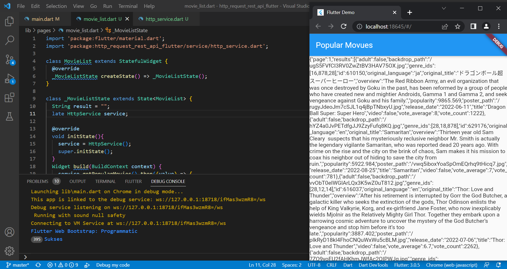
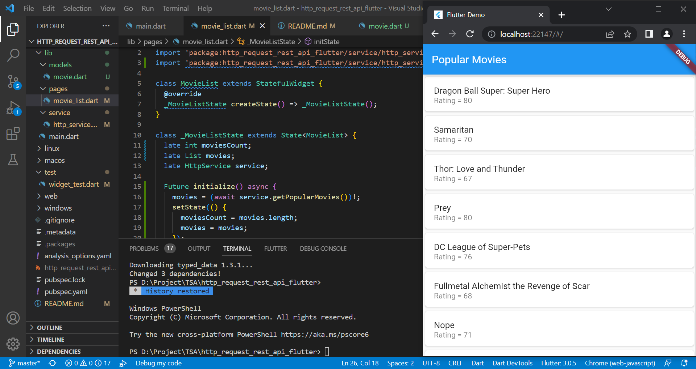
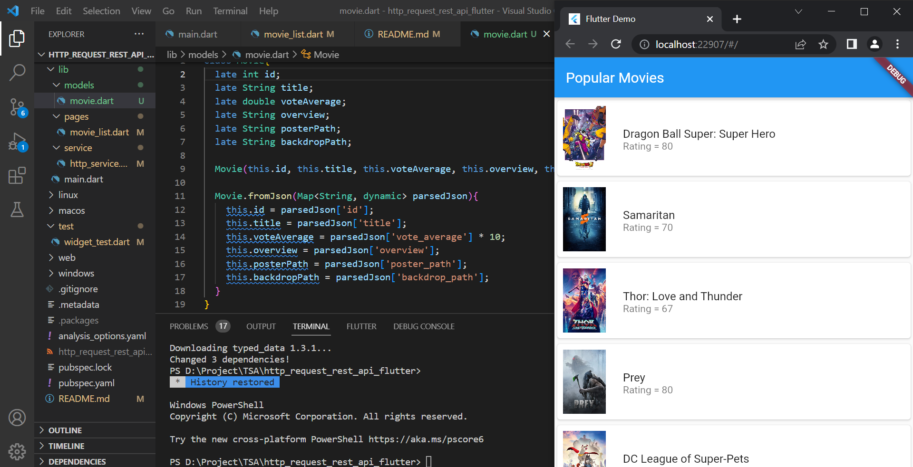
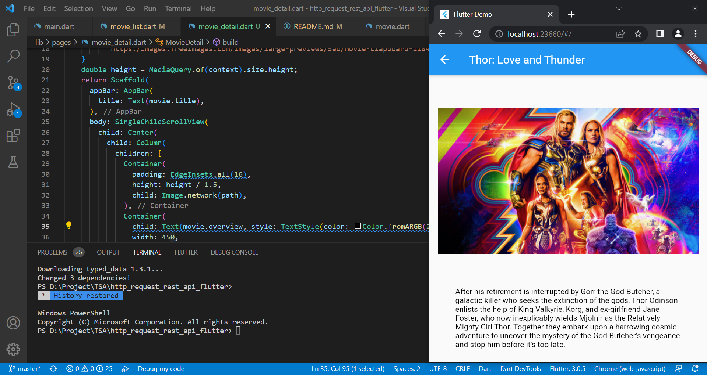

# http_request_rest_api_flutter

A new Flutter project.

## 7.3.2 Mengkoneksikan Aplikasi Flutter ke themoviedb dengan package http

## 7.4 Membuat halaman list Populer Movie
- Membuat List

- Menampilkan Gambar

## 7.5 Membuat halaman detail Populer Movie 
- Detail Populer Movie

- Modifikasi Tampilan

